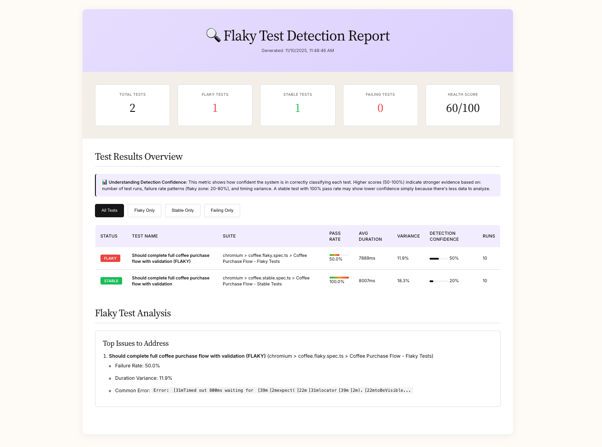
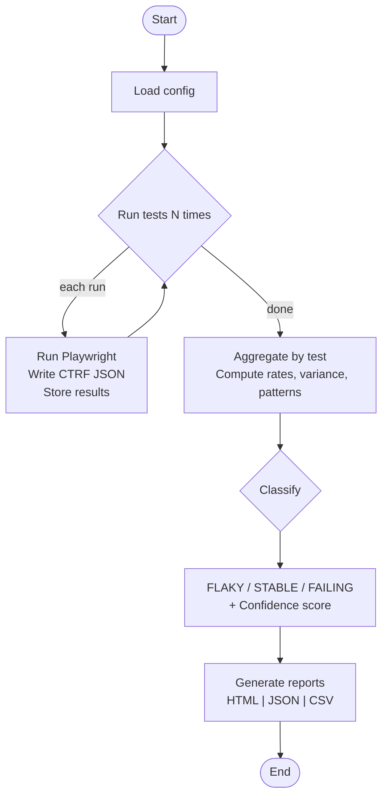

# Playwright Flaky Test Detector

For [Coffee Store](https://coffee-e2e.vercel.app/) demo project ☕️

---

## Why I Built It

Flaky tests waste time and hide bugs. This provides a deterministic target and a repeatable way to measure stability and expose sync issues.

## What It Does

A Playwright-based detector that runs tests repeatedly, classifies them as Stable, Flaky, or Failing using simple statistics, and outputs HTML, JSON, and CSV reports.

- Runs Playwright tests N times (10, 20, 50, 100+)
- Analyzes results using statistical methods
- Generates interactive reports (HTML, JSON, CSV)
- Demonstrates best practices vs anti-patterns
- Provides actionable insights with confidence scores
- Calculates test suite health scores

## Sample Output



**Interactive features:** Filter by test status • View detailed error patterns • Real-time metrics dashboard

[Get started →](#quick-start)

## Data Flow



## Technical Description

### Features

**Detection Engine**

- Statistical analysis (failure rates, duration variance, patterns)
- CTRF integration for standardized parsing
- Confidence scoring based on evidence strength
- Configurable thresholds

**Reporting Suite**

- Interactive HTML
- CSV for spreadsheets

**Educational Value**

- Side-by-side stable vs flaky examples
- 20+ documented anti-patterns
- Reusable helpers following Page Object Model

## Stack

- Playwright, TypeScript, Node.js
- CTRF reporter and JSON artifacts
- Demo app: [coffee-e2e.vercel.app](http://coffee-e2e.vercel.app)

---

## Understanding Reports

### Detection Confidence

Shows confidence in test classification accuracy.

| Score | Meaning |
|-------|---------|
| 80-100% | Very high confidence |
| 50-80% | High confidence |
| 20-50% | Moderate confidence |
| 0-20% | Low confidence |

Calculated from: number of runs (40%), failure rate patterns (30%), duration variance (30%).

### Test Status

| Status | Criteria |
|--------|----------|
| STABLE | Pass rate = 100% |
| FLAKY | Failure rate 10-90% |
| FAILING | Failure rate ≥90% |

### Health Score

```
Health = (Stability × 40%) + (Reliability × 40%) + (Maintainability × 20%)
```

| Score | Action |
|-------|--------|
| 90-100 | Continue monitoring |
| 70-89 | Address flaky tests |
| 50-69 | Urgent attention needed |
| 0-49 | Critical - refactor suite |

---

## Resources

**Inspiration:**

1. [Detecting Flaky Tests in Playwright](https://ray.run/blog/detecting-and-handling-flaky-tests-in-playwright)
2. [Avoiding Flaky Playwright Tests](https://betterstack.com/community/guides/testing/avoid-flaky-playwright-tests/)
3. [Stability Over Luck - Run Tests 100 Times](https://medium.com/@daniel.wentland_49864/stability-over-luck-why-every-new-playwright-test-should-run-at-least-100-times-d85f67ff2845)

**References:**

- [Playwright Best Practices](https://playwright.dev/docs/best-practices)
- [Test Pyramid](https://martinfowler.com/articles/practical-test-pyramid.html)
- [CTRF Specification](https://ctrf.io/)


**Test App:**

- Live: [Coffee E2E - Vercel](https://coffee-e2e.vercel.app/)
- Controlled deployment with logs/database access
- Stable, deterministic test subject

---

## Usage

### Installation

**Prerequisites**: Node.js ≥18, npm, Git

```bash
# Clone
git clone https://github.com/yourusername/flaky-test-detector.git
cd flaky-test-detector

# Install
npm install

# Install browsers
npx playwright install

# Build
npm run build

# Verify
npm test
```

---

### Quick Start

```bash
npm run detect-flaky
```

### Commands

```bash
npm run detect-flaky:quick        # 10 runs
npm run detect-flaky:thorough     # 20 runs
ts-node src/run-flaky-detection.ts 100  # Custom runs

npm run report:open               # Open HTML (macOS)
npm run report:serve              # HTTP server
```

### Individual Tests

```bash
npx playwright test coffee.stable.refactored.spec.ts  # Stable only
npx playwright test coffee.flaky.spec.ts              # Flaky only
npm run test:headed                                   # Headed mode
npm run test:debug                                    # Debug
```
